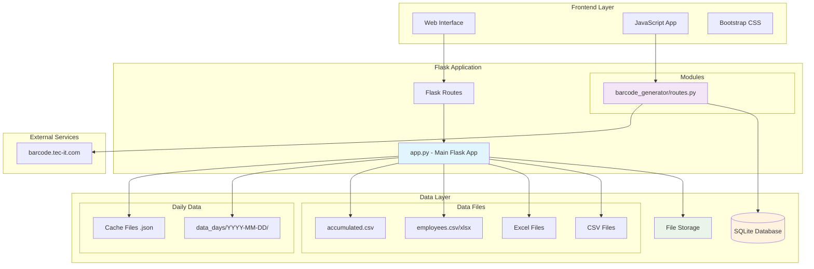
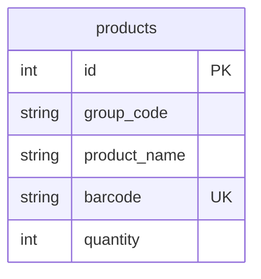
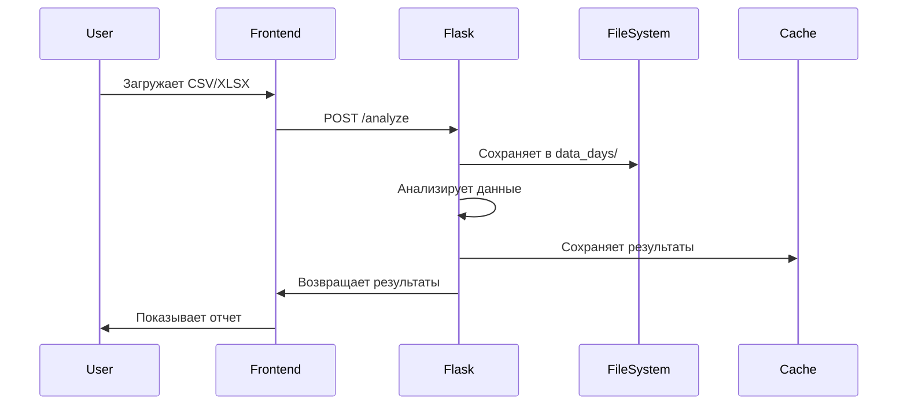
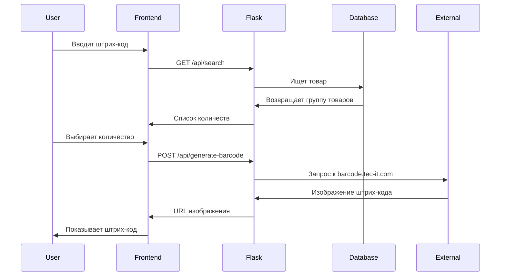

# Архитектура проекта SBL08_11_PROD

## Обзор системы

Это Flask-приложение для анализа складских данных и генерации штрих-кодов, состоящее из двух основных модулей:

1. **Анализатор данных** - обработка CSV/XLSX файлов с данными о складских задачах
2. **Генератор штрих-кодов** - поиск товаров и создание штрих-кодов для упаковок

## Архитектурная диаграмма



## Структура модулей

### 1. Основное приложение (app.py)

**Функциональность:**
- Загрузка и анализ CSV/XLSX файлов
- Обработка данных о складских задачах
- Расчет статистики по сотрудникам
- Анализ перерывов и активного времени
- Кэширование результатов по дням
- Календарь загруженных данных

**Основные маршруты:**
- `/` - главная страница
- `/analyze` - анализ загруженного файла
- `/analyze_day/<date>` - анализ конкретного дня
- `/day_summary/<date>` - краткая сводка по дню
- `/clear_accumulator` - очистка данных
- `/upload_employees` - загрузка файла сотрудников

### 2. Генератор штрих-кодов (modules/barcode_generator/)

**Функциональность:**
- Поиск товаров по штрих-коду или группе
- Генерация штрих-кодов для разных количеств
- Сохранение и печать штрих-кодов
- PRO-режим для быстрого сканирования

**API маршруты:**
- `/barcode/` - интерфейс генератора
- `/barcode/api/search` - поиск товара
- `/barcode/api/generate-barcode` - генерация штрих-кода
- `/barcode/api/save-barcode` - сохранение файла

## Структура данных

### База данных (SQLite)



### Файловая структура данных

```
data_days/
├── 2025-10-08/
│   ├── 2025-10-08.csv          # Исходные данные дня
│   ├── ANL.csv                 # Результаты анализа
│   ├── ANL_breaks.json         # Данные о перерывах
│   ├── ANL_hourly.json         # Почасовая статистика
│   └── IT.json                 # Краткая сводка
├── 2025-10-09/
│   └── ...
employees.csv/xlsx              # Маппинг сотрудник -> компания
accumulated.csv                 # Накопительный файл
```

## Поток данных

### Анализ данных



### Генерация штрих-кодов



## Технологический стек

### Backend
- **Flask 3.0.3** - веб-фреймворк
- **pandas 2.2.2** - обработка данных
- **SQLite** - база данных
- **openpyxl 3.1.2** - работа с Excel

### Frontend
- **Bootstrap 5.3.3** - UI фреймворк
- **Font Awesome 6.0.0** - иконки
- **Vanilla JavaScript** - интерактивность

### Внешние сервисы
- **barcode.tec-it.com** - генерация изображений штрих-кодов

## Особенности архитектуры

### 1. Модульная структура
- Основное приложение и модули разделены
- Blueprint для изоляции функциональности
- Независимые базы данных для разных модулей

### 2. Кэширование
- Результаты анализа кэшируются по дням
- Инвалидация кэша при добавлении новых данных
- Атомарная запись файлов кэша

### 3. Обработка данных
- Робастное чтение CSV с разными кодировками
- Поддержка различных форматов чисел
- Автоматическое определение столбцов

### 4. Пользовательский интерфейс
- Адаптивный дизайн
- Календарь для навигации по дням
- PRO-режим для быстрой работы со сканером

### 5. Безопасность
- Ограничение размера загружаемых файлов
- Валидация входных данных
- Безопасные имена файлов

## Развертывание

Приложение может быть развернуто как:
- Локальный сервер разработки
- WSGI-приложение (через wsgi.py)
- Контейнер Docker
- Облачная платформа

## Масштабируемость

Текущая архитектура подходит для:
- Малых и средних объемов данных
- Локального использования
- Команд до 50 пользователей

Для масштабирования потребуется:
- Переход на PostgreSQL/MySQL
- Добавление Redis для кэширования
- Разделение на микросервисы
- Добавление очередей задач
